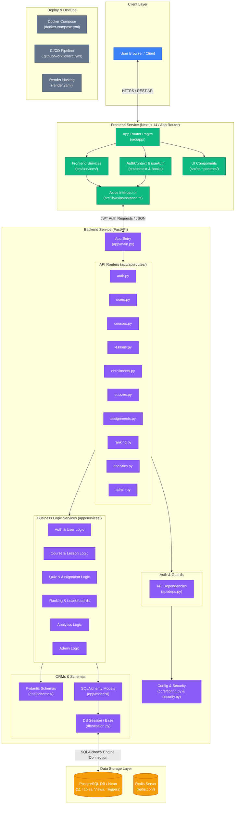

```mermaid
flowchart TB
subgraph Client["Client Layer"]
Browser["User Browser / Client"]
end

    subgraph Frontend["Frontend Service (Next.js 14 / App Router)"]
        direction TB
        AppRouter["App Router Pages\n(src/app/)"]
        AuthCtx["AuthContext & useAuth\n(src/context & hooks)"]
        Axios["Axios Interceptor\n(src/lib/axiosInstance.ts)"]
        FServices["Frontend Services\n(src/services/)"]
        Components["UI Components\n(src/components/)"]

        AppRouter --> Components
        AppRouter --> AuthCtx
        AppRouter --> FServices
        FServices --> Axios
        AuthCtx --> Axios
    end

    subgraph Infrastructure["Deploy & DevOps"]
        DockerCompose["Docker Compose\n(docker-compose.yml)"]
        GitHubActions["CI/CD Pipeline\n(.github/workflows/ci.yml)"]
        Render["Render Hosting\n(render.yaml)"]
    end

    subgraph Backend["Backend Service (FastAPI)"]
        direction TB
        Main["App Entry\n(app/main.py)"]
        Config["Config & Security\n(core/config.py & security.py)"]

        subgraph SecurityDeps["Auth & Guards"]
            Deps["API Dependencies\n(api/deps.py)"]
        end

        subgraph Routes["API Routers (app/api/routes/)"]
            R_Auth["auth.py"]
            R_Users["users.py"]
            R_Courses["courses.py"]
            R_Lessons["lessons.py"]
            R_Enrollments["enrollments.py"]
            R_Quizzes["quizzes.py"]
            R_Assignments["assignments.py"]
            R_Ranking["ranking.py"]
            R_Analytics["analytics.py"]
            R_Admin["admin.py"]
        end

        subgraph Services["Business Logic Services (app/services/)"]
            S_Auth["Auth & User Logic"]
            S_Course["Course & Lesson Logic"]
            S_Quiz["Quiz & Assignment Logic"]
            S_Ranking["Ranking & Leaderboards"]
            S_Analytics["Analytics Logic"]
            S_Admin["Admin Logic"]
        end

        subgraph DataLayer["ORMs & Schemas"]
            Schemas["Pydantic Schemas\n(app/schemas/)"]
            Models["SQLAlchemy Models\n(app/models/)"]
            DBSession["DB Session / Base\n(db/session.py)"]
        end

        Main --> Routes
        Routes --> SecurityDeps
        SecurityDeps --> Config
        Routes --> Services
        Services --> Schemas
        Services --> Models
        Models --> DBSession
    end

    subgraph Persistence["Data Storage Layer"]
        PostgreSQL[("PostgreSQL DB / Neon\n(11 Tables, Views, Triggers)")]
        RedisDB[("Redis Server\n(redis.conf)")]
    end

    %% Network Connections
    Browser <-->|HTTPS / REST API| Frontend
    Axios <-->|JWT Auth Requests / JSON| Main
    DBSession <-->|SQLAlchemy Engine Connection| PostgreSQL

    %% Styling
    classDef client fill:#3b82f6,stroke:#1d4ed8,color:#ffffff
    classDef frontend fill:#10b981,stroke:#047857,color:#ffffff
    classDef backend fill:#8b5cf6,stroke:#6d28d9,color:#ffffff
    classDef db fill:#f59e0b,stroke:#b45309,color:#ffffff
    classDef infra fill:#64748b,stroke:#334155,color:#ffffff

    class Browser client
    class AppRouter,AuthCtx,Axios,FServices,Components frontend
    class Main,Config,Deps,R_Auth,R_Users,R_Courses,R_Lessons,R_Enrollments,R_Quizzes,R_Assignments,R_Ranking,R_Analytics,R_Admin,S_Auth,S_Course,S_Quiz,S_Ranking,S_Analytics,S_Admin,Schemas,Models,DBSession backend
    class PostgreSQL,RedisDB db
    class DockerCompose,GitHubActions,Render infra


```
